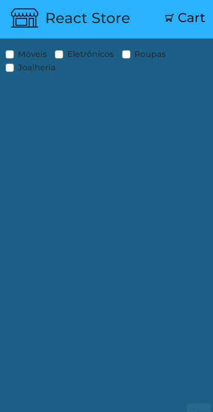

<h1>React Store  🛍️ </h1>
<hr />
<h2>Descrição</h2>
<p style='font-size:16px'>Projeto individual desenvolvido por mim mesmo afim de compor meu repositório, mostrando features e conhecimento sobre ferramentas.</p>
<hr />
<h2>Frameworks e bibliotecas:</h2>
<ul style='font-size:17px'>
  <li>
    <a href='https://nextjs.org/'>NextJs</a>
  </li>
  <li>
    <a href='https://reactjs.org/'>React</a>
  </li>
  <li>
    <a href='https://getbootstrap.com/'>Bootstrap</a> |
    <a href='https://reactstrap.github.io/?path=/story/home-installation--page'>Reactstrap</a>
  </li>
</ul>
<hr />
<h2>Demo 📷</h2>
<div display='flex'> 
  
  
</div>
<hr/>
<h2>Publicação</h2>
<p align='center' style='font-size:17px'>Você pode visualizar o repositório hospedado na Vercel <a href=''>aqui</a></p>
<hr/>
<h2>Como rodar na sua máquina</h2>
<h3 style='font-size:16px'>Pré-requisitos:</h3>
<p style='font-size:16px'>Para rodar o projeto, é preciso que você tenha as ferramentas <a href='https://git-scm.com/'>Git</a> e <a href='https://nodejs.org/en/'>Node.js</a>. Além de também ser interessante um editor de código, como o <a href='https://code.visualstudio.com/'>VsCode</a>. </p>

```bash
#Clone este repositório
git clone https://github.com/davimoreiraa/Adopet.git

#Acesse a pasta usando o terminal
cd adopet

#Instale as depedências
npm install

#Execute a aplicação
npm run dev
```

<hr/>

<footer>
  <p style='font-size:17px'>🍊 Made by Davi Moreira | See my 
    <a href="https://www.linkedin.com/in/davi-moreira-dos-santos-804280203/">LinkedIn</a>
  </p>
</footer>
